## Node.js超入門

安部裕太

---

## 本日の内容
- Webページのオブジェクト
- データのやり取りをマスターしよう
- パーシャル、アプリケーション

---

## Webページのオブジェクト

+++
### イベントとは？
- onclickやonloadをイベントと言う |
- イベントを使うことによって操作や動作に応じて処理を実行できる |

+++?code=A-16.html
@[10](ロードし終わったら関数を実行)
@[14](クリックすると関数を実行)

+++?code=A-17.js
@[5,6](それぞれのidのタグを操作するオブジェクトを取り出す)
@[7,11](textContentの値を変更することによって表示するテキストを変更できる)

+++
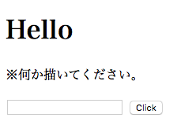

+++
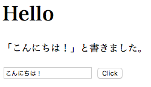

+++?code=A-18.js

+++
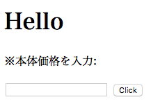

+++
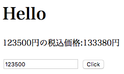

+++
### まとめ
- どのような時にイベントを使うか？ 
 - 操作や動作に応じて処理を実行したい時 |
- クリックした時とロードした時にイベントを発生するものは？ |
 - onclick,onload |
- idのタグを操作するオブジェクトを取り出すには？ 
 - getElementById |
- どのプロパティを変更することによってテキストを変更することができるか？ 
 - textContent |

---
## データのやり取りをマスターしよう

+++
### クエリーパラメーター
- URLの後ろに付いていることがある「?」から始まる文字列　|
- 必要な値をサーバーに渡すことができる |

+++
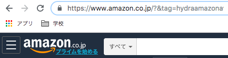

+++?code=3-1.js
@[19](第二引数にtrueを追加)
@[24](クエリーパラメーターのオブジェクトを保管)
@[25](msgが未定義の場合を考慮する！)

+++
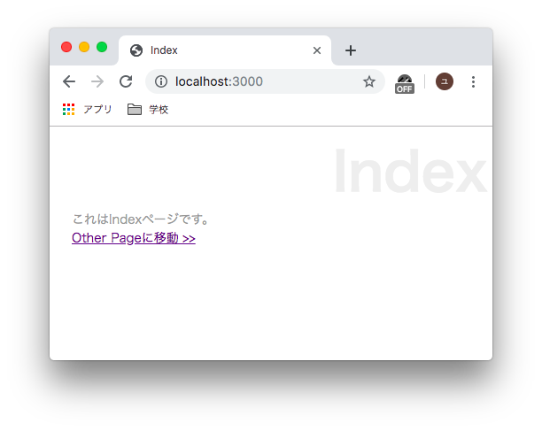

+++
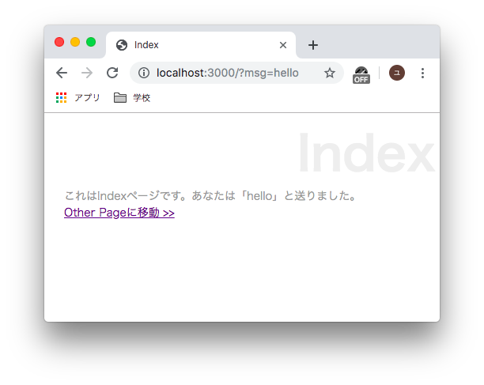

+++
ユーザーの入力をサーバーに反映することができた！


しかしクエリーパラメーターは少し不便… 

+++
### そこでフォーム送信を行う！ 

+++
### フォームの送信を行う
フォームの送信手順
1. 送られたフォームのデータを受け取る 
1. 受け取ったデータをパースする 
1. 必要な値を取り出して処理をする 

+++?code=3-2.ejs
@[17](/2-17にPOST送信ができるようにしている)

+++?code=3-3.js
@[5](Query Stringモジュール取得)
@[59](POST送信されたかをチェック)
@[63,68](イベント処理)
@[63](データ受け取り時に発生)
@[68](データ受け取り完了時に発生)
@[60,63,64,65]()
@[69](エンコードする)

+++
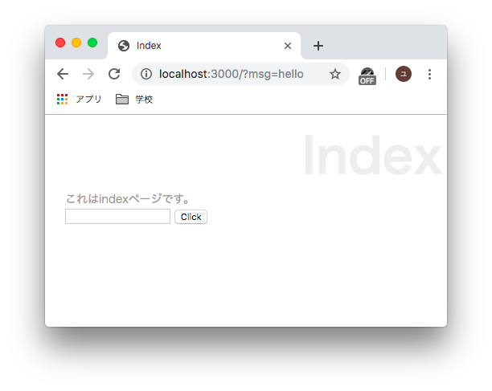

+++


+++
### GETとPOSTの違い
- GET
 - いつどのようにアクセスしても同じ結果が返される |
- POST
 - その時の状況によって返す結果が変化 |

+++?code=3-4.js
@[44,45,46,47,48,49]

+++?code=3-5.css


+++?code=3-6.ejs


+++


+++
### まとめ
- エンコードするためにrequireするものは？
 - querystring |
- データ受け取り時とデータ受け取り完了時にイベントを発生させるものは？
 - data,end |
- クライアントから受け取ったデータを使えるようにするためにすることは？
 - パース qs.parse() |
 
+++
- GETとPOSTの違いは？
 - 常に同じか変化するか |
- テンプレート側で処理を実行したい場合は？
 - <% %> |

---
## パーシャル、アプリケーション

+++
### パーシャルとは
- 汎用性のあるものを部品として分けたもの |
- 今回はテーブルの内容を汎用的に変更するようにする |

+++?code=3-7.ejs

+++
```
<% for(var key in data){ %>
<%- include('3-7',{key:key,val:[data[key]]})%>
<%  } %>
```
@[2](パーシャルを読み込む)

+++?code=3-9.js
@[58](filenameと言う値を追加)

+++
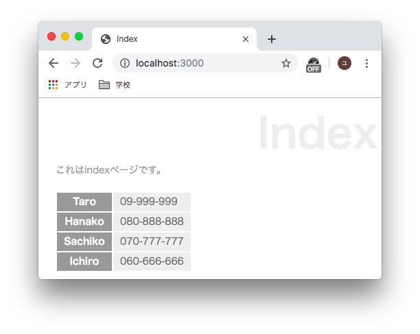

+++?code=3-10.ejs


+++?code=3-11.js
@[65,66,67,68,69,70,79]
@[80](filenameと言う値を追加)

+++
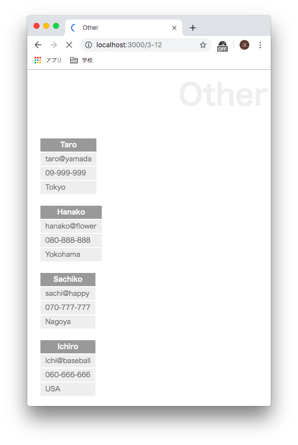

+++?code=3-13.ejs
@[23](保管しているメッセージを表示)
@[29](入力された値をmsgに入れる)

+++?code=3-14.js
@[44](dataのmsgプロパティを初期化)

+++
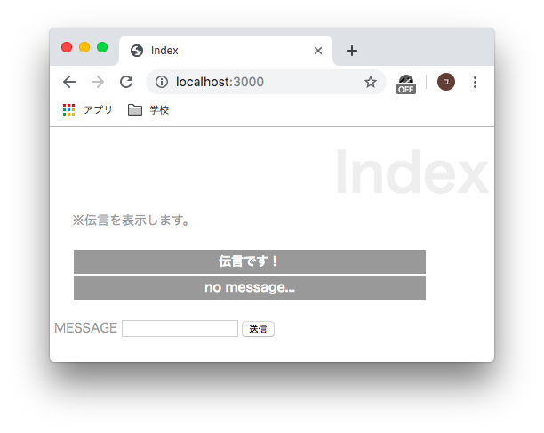

+++


+++
### まとめ
- パーシャルを読み込む時に使う関数は?
 - include |
- それを呼び出す時に使わなければならないタグは？
 - <%- %> |


